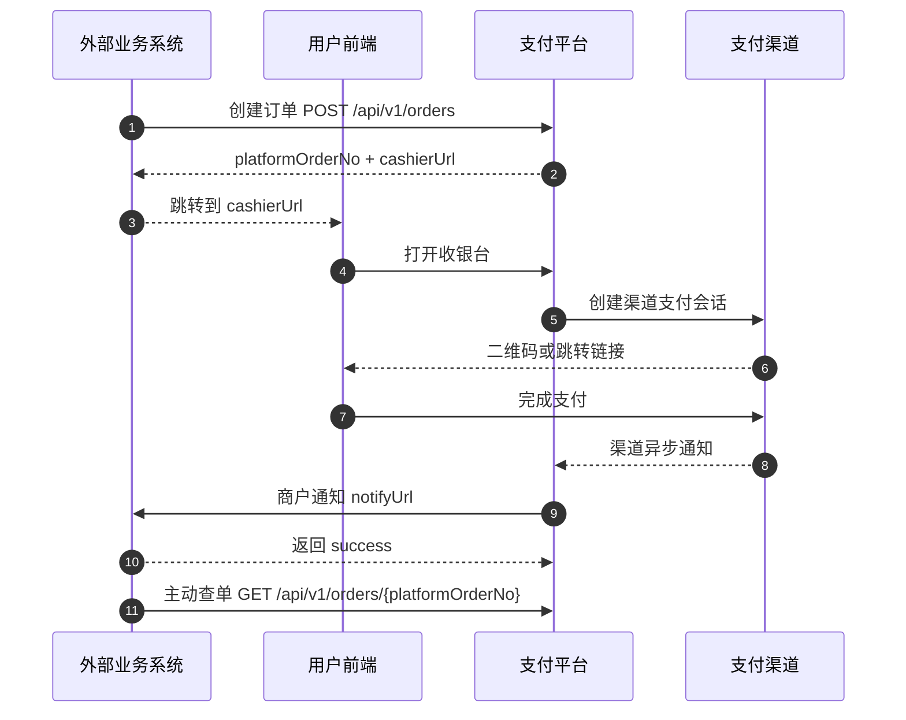
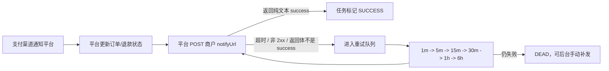

# 外部业务系统接入教程

本文面向“外部业务系统”或“商户自有系统”接入当前支付平台的场景，内容基于仓库当前实现整理，不是假设性的接口设计。

当前版本要点：

- 对外商户接口统一走 `HMAC-SHA256` 签名，不支持生产可用的 `RSA2` 商户签名接入。
- 推荐接入方式是：业务系统下单后，直接把用户带到平台返回的 `cashierUrl`。
- 支付渠道的异步通知先到平台，再由平台统一转发到商户 `notifyUrl`。
- 目前支付宝链路最完整，已接通下单、查单、关单、退款和回调验签；其他渠道更多是骨架或占位能力。

## 1. 先理解接入角色

- 外部业务系统：你的服务端，负责创建订单、查单、关单、退款、接收平台通知。
- 用户前端：你的 App/H5/PC 页面，负责跳转或打开收银台。
- 当前支付平台：负责管理订单、生成收银台、对接真实支付渠道、统一通知商户。
- 支付渠道：例如支付宝。



这张图里最重要的一点是：

- 商户系统不直接对接支付宝回调地址。
- 商户系统只需要接平台转发过来的 `notifyUrl` 通知。

## 2. 接入前准备

正式接入前，至少准备好下面这些内容。

### 2.1 平台侧提供给商户的信息

- `appId`
- `appSecret`
- 允许使用的支付渠道列表，例如 `alipay_qr`、`alipay_wap`
- 平台 API 地址，例如 `https://pay.example.com/api/v1`

当前代码里默认有两个可用于本地联调的 HMAC 演示应用：

- `demo_app` / `demo_app_secret`
- `demo_app_other` / `demo_app_other_secret`

### 2.2 商户侧需要提供给平台的信息

- 商户异步通知地址 `notifyUrl`
- 可选的支付完成返回地址 `returnUrl`

`notifyUrl` 要求：

- 必须能被平台服务端访问到
- 能接收 `POST application/json`
- 成功处理后必须返回纯文本 `success`

### 2.3 平台管理员需要先完成的配置

这些通常不是商户系统来做，但接入前必须确认已配置：

- `APP_BASE_URL`
  - 用来生成平台自己的渠道通知地址，例如支付宝回调地址
- `WEB_BASE_URL`
  - 用来生成商户拿到的 `cashierUrl`
- 对应支付渠道配置
  - 例如支付宝的 `ALIPAY_APP_ID`、`ALIPAY_PRIVATE_KEY`、`ALIPAY_PUBLIC_KEY`、`ALIPAY_GATEWAY`

### 2.4 时间和幂等要求

- `X-Timestamp` 必须是毫秒时间戳
- 平台允许的时钟误差是 5 分钟
- `X-Nonce` 不能重放，平台会做短窗口防重
- 写接口必须带 `Idempotency-Key`

### 2.5 当前渠道现状

| 渠道代码 | 当前状态 | 说明 |
| --- | --- | --- |
| `alipay_qr` | 可联调 | 已接通真实下单、查单、关单、退款、回调验签 |
| `alipay_wap` | 可联调 | 适合移动端 H5 / WAP 拉起 |
| `wechat_qr` / `wechat_jsapi` | 骨架能力 | 当前主要是直连 API 预留，未形成完整真实交易链路 |
| `stripe_checkout` | 骨架能力 | 当前只有渠道目录和配置检测，未形成完整真实交易链路 |
| `paypal_checkout` | 骨架能力 | 当前只有渠道目录和配置检测，未形成完整真实交易链路 |

如果你要做当前版本的真实联调，优先使用支付宝通道。

## 3. 当前推荐接入路径

大多数业务系统直接按下面的路径走即可：

1. 服务端调用创建订单接口。
2. 拿到 `cashierUrl` 后，把用户跳转到这个地址。
3. 等待平台异步通知 `notifyUrl`。
4. 如果通知迟到或丢失，商户主动查单兜底。
5. 需要撤销未支付订单时，调用关单接口。
6. 需要退款时，调用退款接口。

如果你一定要自己画收银台，也可以：

1. 先拿创建订单返回的 `cashierUrl`
2. 从 URL 最后一段取出 `cashierToken`
3. 调用 `GET /api/v1/cashier/{cashierToken}` 拉取渠道会话
4. 自己渲染二维码或跳转按钮

建议优先使用平台默认收银台。这样你不用自己处理渠道会话刷新、会话复用和不同渠道的展示差异。

## 4. 基础约定

### 4.1 基础地址

- API 根地址：`{your-host}/api/v1`
- Swagger：`{your-host}/api/docs`

本地默认地址：

- API：`http://localhost:3000/api/v1`
- Swagger：`http://localhost:3000/api/docs`
- Web：`http://localhost:5173`

### 4.2 统一响应格式

无论成功还是失败，平台都返回统一包裹结构：

```json
{
  "code": "SUCCESS",
  "message": "OK",
  "requestId": "0e9cfed4-2d31-4b3b-8d54-fdfb3c61b8f0",
  "data": {}
}
```

说明：

- `code`：业务码，不要只看 HTTP 状态码
- `message`：可读错误信息
- `requestId`：链路追踪 ID
- `data`：业务结果，失败时固定为 `null`

你也可以主动传 `X-Request-Id`，平台会原样透传回响应头和响应体。

## 5. 商户请求签名

### 5.1 必填请求头

所有商户接口都要带：

- `X-App-Id`
- `X-Timestamp`
- `X-Nonce`
- `X-Sign-Type`
- `X-Sign`

只有写接口额外要求：

- `Idempotency-Key`

当前唯一支持的签名类型：

- `X-Sign-Type: HMAC-SHA256`

### 5.2 签名串拼接规则

签名串由 6 行组成，使用换行符 `\n` 连接：

```text
HTTP_METHOD
PATH_WITH_SORTED_QUERY
X-App-Id
X-Timestamp
X-Nonce
SHA256(CANONICAL_JSON_BODY)
```

其中：

- `HTTP_METHOD`
  - 大写，例如 `POST`、`GET`
- `PATH_WITH_SORTED_QUERY`
  - 只包含 path 和 query，不包含域名
  - query 需要按 `key` 升序排序；同名参数按 `value` 升序排序
- `CANONICAL_JSON_BODY`
  - 对象 key 按字典序排序
  - 数组保持原顺序
  - 没有 body 时使用空字符串

示例：

```text
GET
/api/v1/orders?merchantOrderNo=ORDER_10001
demo_app
1741852800000
8f1b91f90f7f4d9a
e3b0c44298fc1c149afbf4c8996fb92427ae41e4649b934ca495991b7852b855
```

签名算法：

```text
hex(HMAC_SHA256(appSecret, signingContent))
```

### 5.3 Node.js 签名示例

```js
import { createHash, createHmac } from "node:crypto";

function canonicalPath(path) {
  const url = new URL(path, "http://localhost");
  const entries = [...url.searchParams.entries()].sort(([aKey, aValue], [bKey, bValue]) => {
    if (aKey === bKey) {
      return aValue.localeCompare(bValue);
    }

    return aKey.localeCompare(bKey);
  });
  const query = new URLSearchParams(entries).toString();

  return query ? `${url.pathname}?${query}` : url.pathname;
}

function stableStringify(value) {
  return JSON.stringify(sortJsonValue(value));
}

function sortJsonValue(value) {
  if (Array.isArray(value)) {
    return value.map((item) => sortJsonValue(item));
  }

  if (value && typeof value === "object" && Object.getPrototypeOf(value) === Object.prototype) {
    return Object.keys(value)
      .sort()
      .reduce((result, key) => {
        result[key] = sortJsonValue(value[key]);
        return result;
      }, {});
  }

  return value;
}

function sha256Hex(content) {
  return createHash("sha256").update(content).digest("hex");
}

export function signMerchantRequest({ method, path, appId, timestamp, nonce, body, appSecret }) {
  const canonicalBody = typeof body === "undefined" ? "" : stableStringify(body);
  const content = [
    method.toUpperCase(),
    canonicalPath(path),
    appId,
    timestamp,
    nonce,
    sha256Hex(canonicalBody)
  ].join("\n");

  return createHmac("sha256", appSecret).update(content).digest("hex");
}
```

## 6. 核心接口接入步骤

### 6.1 创建订单

接口：

- `POST /api/v1/orders`

典型请求体：

```json
{
  "merchantOrderNo": "ORDER_202603130001",
  "amount": 9900,
  "currency": "CNY",
  "subject": "VIP会员",
  "description": "年费会员",
  "notifyUrl": "https://merchant.example.com/pay/notify",
  "returnUrl": "https://merchant.example.com/pay/result",
  "expireInSeconds": 900,
  "allowedChannels": ["alipay_qr", "alipay_wap"],
  "metadata": {
    "scene": "web_checkout",
    "userId": "U10001"
  }
}
```

字段说明：

- `amount`
  - 单位是分
- `expireInSeconds`
  - 当前限制 `60 ~ 1800`
  - 不传时默认 `900`
- `allowedChannels`
  - 可不传
  - 不传时使用商户应用默认渠道
  - 传了也不能超出商户应用允许范围

成功响应示例：

```json
{
  "code": "SUCCESS",
  "message": "OK",
  "requestId": "req_123",
  "data": {
    "platformOrderNo": "P20260313143000999",
    "merchantOrderNo": "ORDER_202603130001",
    "status": "WAIT_PAY",
    "cashierUrl": "https://pay.example.com/cashier/eyJwbGF0Zm9ybU9yZGVyTm8iOiJQMjAyNjAzMTMxNDMwMDA5OTkiLCJleHBpcmVUaW1lIjoiMjAyNi0wMy0xM1QxNDo0NTowMC4wMDBaIn0.signature",
    "expireTime": "2026-03-13T14:45:00.000Z",
    "channels": [
      {
        "providerCode": "ALIPAY",
        "displayName": "支付宝",
        "integrationMode": "OFFICIAL_NODE_SDK",
        "supportedChannels": ["alipay_qr", "alipay_wap"],
        "officialSdkPackage": "alipay-sdk",
        "enabled": true,
        "note": "优先使用支付宝官方 Node SDK；当前已接入二维码预下单、WAP 拉起、查单、关单、退款和回调验签。"
      }
    ]
  }
}
```

创建订单后，你真正需要保存的关键字段是：

- `platformOrderNo`
- `merchantOrderNo`
- `cashierUrl`
- `expireTime`

接下来的用户支付入口，优先直接使用 `cashierUrl`。

### 6.2 拉起收银台

推荐方式：

- 服务端创建订单后，把 `cashierUrl` 返回给前端
- 前端直接跳转或新开页面访问 `cashierUrl`

不推荐但可用的高级方式：

- 前端从 `cashierUrl` 末尾拿到 `cashierToken`
- 调用 `GET /api/v1/cashier/{cashierToken}`
- 自己根据返回的 `channels` 渲染二维码或跳转按钮

自定义收银台响应示例：

```json
{
  "code": "SUCCESS",
  "message": "OK",
  "requestId": "req_456",
  "data": {
    "order": {
      "appId": "demo_app",
      "platformOrderNo": "P20260313143000999",
      "merchantOrderNo": "ORDER_202603130001",
      "amount": 9900,
      "paidAmount": 0,
      "currency": "CNY",
      "subject": "VIP会员",
      "status": "WAIT_PAY",
      "notifyUrl": "https://merchant.example.com/pay/notify",
      "returnUrl": "https://merchant.example.com/pay/result",
      "expireTime": "2026-03-13T14:45:00.000Z",
      "createdAt": "2026-03-13T14:30:00.000Z",
      "paidTime": null,
      "allowedChannels": ["alipay_qr", "alipay_wap"],
      "cashierUrl": "https://pay.example.com/cashier/xxx"
    },
    "channels": [
      {
        "providerCode": "ALIPAY",
        "channel": "alipay_qr",
        "displayName": "支付宝",
        "integrationMode": "OFFICIAL_NODE_SDK",
        "enabled": true,
        "sessionStatus": "READY",
        "actionType": "QR_CODE",
        "attemptNo": "A20260313143000001",
        "channelRequestNo": "P20260313143000999",
        "qrContent": "https://qr.alipay.com/xxx",
        "expireTime": "2026-03-13T14:45:00.000Z",
        "note": "优先使用支付宝官方 Node SDK；当前已接入二维码预下单、WAP 拉起、查单、关单、退款和回调验签。"
      }
    ]
  }
}
```

`channels` 中最重要的几个字段：

- `sessionStatus`
  - `READY` 才表示可展示
- `actionType`
  - `QR_CODE` 表示展示二维码
  - `REDIRECT_URL` 表示跳转链接
- `qrContent`
  - 二维码内容
- `payUrl`
  - 跳转支付链接

### 6.3 查单

两个接口都支持：

- `GET /api/v1/orders?merchantOrderNo={merchantOrderNo}`
- `GET /api/v1/orders/{platformOrderNo}`

说明：

- 订单处于 `WAIT_PAY` 或 `PAYING` 时，平台可能会自动向渠道补查一次
- 所以查单不仅是“读数据库”，还可能顺便把订单状态推进到最新

查单返回的 `data` 结构是完整订单对象，常用字段包括：

- `status`
- `channel`
- `paidAmount`
- `paidTime`
- `cashierUrl`

### 6.4 关单

接口：

- `POST /api/v1/orders/{platformOrderNo}/close`

请求体：

```json
{
  "reason": "merchant_cancel"
}
```

说明：

- 写接口，必须带 `Idempotency-Key`
- 如果订单已支付、已关闭、已过期，平台会直接返回当前状态，不会报错
- 如果该订单已经发起过渠道会话，平台会尝试先调用渠道关单

### 6.5 退款

接口：

- `POST /api/v1/refunds`

请求体：

```json
{
  "platformOrderNo": "P20260313143000999",
  "merchantRefundNo": "REFUND_202603130001",
  "refundAmount": 3000,
  "reason": "user_cancel"
}
```

退款成功响应里的 `data` 结构：

```json
{
  "appId": "demo_app",
  "merchantRefundNo": "REFUND_202603130001",
  "platformRefundNo": "R20260313150000123",
  "platformOrderNo": "P20260313143000999",
  "refundAmount": 3000,
  "status": "SUCCESS",
  "reason": "user_cancel",
  "createdAt": "2026-03-13T15:00:00.000Z",
  "successTime": "2026-03-13T15:00:02.000Z"
}
```

退款限制：

- 只有已支付或已退款订单可以退款
- 退款总额不能超过实付金额
- 订单必须有可退款的成功支付渠道
- 当前只有真实已接通且已配置的渠道才能退款

退款查询接口：

- `GET /api/v1/refunds/{merchantRefundNo}`

## 7. 平台异步通知商户

平台把渠道结果确认后，会向下单时传入的 `notifyUrl` 发起 `POST` 请求。

当前支付成功和退款成功都会创建通知任务：

- `PAY_SUCCESS`
- `REFUND_SUCCESS`

### 7.1 商户通知链路



### 7.2 商户通知请求头

平台通知商户时会带这些头：

- `X-App-Id`
- `X-Notify-Id`
- `X-Timestamp`
- `X-Nonce`
- `X-Sign-Type`
- `X-Sign`

注意：

- 头名大小写不敏感
- 当前签名类型同样是 `HMAC-SHA256`
- 使用的密钥仍然是商户自己的 `appSecret`

### 7.3 商户通知签名规则

平台通知商户时，签名串是 4 行：

```text
X-Notify-Id
X-Timestamp
X-Nonce
SHA256(REQUEST_BODY)
```

签名算法：

```text
hex(HMAC_SHA256(appSecret, signingContent))
```

### 7.4 通知报文示例

支付成功：

```json
{
  "notifyId": "N20260313143100123",
  "businessType": "PAY_ORDER",
  "businessNo": "P20260313143000999",
  "eventType": "PAY_SUCCESS",
  "platformOrderNo": "P20260313143000999",
  "merchantOrderNo": "ORDER_202603130001",
  "appId": "demo_app",
  "amount": 9900,
  "paidAmount": 9900,
  "status": "SUCCESS",
  "currency": "CNY",
  "channel": "alipay_qr",
  "paidTime": "2026-03-13T14:31:00.000Z"
}
```

退款成功：

```json
{
  "notifyId": "N20260313150100999",
  "businessType": "REFUND_ORDER",
  "businessNo": "R20260313150000123",
  "eventType": "REFUND_SUCCESS",
  "platformRefundNo": "R20260313150000123",
  "merchantRefundNo": "REFUND_202603130001",
  "platformOrderNo": "P20260313143000999",
  "appId": "demo_app",
  "refundAmount": 3000,
  "status": "SUCCESS",
  "reason": "user_cancel",
  "successTime": "2026-03-13T15:00:02.000Z"
}
```

### 7.5 商户通知验签示例

```js
import { createHash, createHmac, timingSafeEqual } from "node:crypto";

function sha256Hex(content) {
  return createHash("sha256").update(content).digest("hex");
}

export function verifyPlatformNotify({ headers, rawBody, appSecret }) {
  const notifyId = headers["x-notify-id"];
  const timestamp = headers["x-timestamp"];
  const nonce = headers["x-nonce"];
  const signature = headers["x-sign"];
  const signType = headers["x-sign-type"];

  if (signType !== "HMAC-SHA256") {
    return false;
  }

  const content = [
    notifyId,
    timestamp,
    nonce,
    sha256Hex(rawBody)
  ].join("\n");

  const expected = createHmac("sha256", appSecret).update(content).digest("hex");

  if (!signature || expected.length !== signature.length) {
    return false;
  }

  return timingSafeEqual(Buffer.from(expected), Buffer.from(signature));
}
```

### 7.6 商户通知回包规则

商户处理成功后，必须返回：

```text
success
```

注意是纯文本，不是 JSON。下面这些情况平台都会判定为失败并重试：

- HTTP 非 `2xx`
- 请求超时
- 返回体不是 `success`

## 8. 幂等和唯一性规则

这里是接入时最容易忽略、但最关键的部分。

### 8.1 `Idempotency-Key`

以下接口必须带：

- `POST /api/v1/orders`
- `POST /api/v1/orders/{platformOrderNo}/close`
- `POST /api/v1/refunds`

规则：

- 同一个 `Idempotency-Key` + 同一业务动作 + 同一商户应用，只能对应同一份请求
- 相同请求重试时，平台会回放第一次成功结果
- 如果参数不同，会返回 `IDEMPOTENT_CONFLICT`

### 8.2 业务单号唯一性

- `merchantOrderNo` 在同一个 `appId` 下必须唯一
- `merchantRefundNo` 在同一个 `appId` 下必须唯一

如果你重复提交相同业务单号：

- 请求参数完全一致：返回已有记录
- 请求参数不一致：返回冲突错误

## 9. 常用状态和错误码

### 9.1 订单状态

- `WAIT_PAY`：待支付
- `PAYING`：支付中
- `SUCCESS`：支付成功
- `CLOSED`：已关闭
- `EXPIRED`：已超时关闭
- `REFUND_PART`：部分退款
- `REFUND_ALL`：全额退款

### 9.2 退款状态

- `CREATED`：退款记录已创建，待调用渠道
- `PROCESSING`：渠道处理中
- `SUCCESS`：退款成功
- `FAILED`：退款失败
- `CLOSED`：退款关闭

### 9.3 常见错误码

| 错误码 | 含义 | 常见原因 |
| --- | --- | --- |
| `AUTH_INVALID` | 鉴权失败 | `appId` 无效、时间戳非法、时间过期、缺少密钥 |
| `SIGN_INVALID` | 签名失败 | 签名串不一致、签名类型不是 `HMAC-SHA256` |
| `NONCE_REPLAY` | nonce 重放 | 同一 `X-Nonce` 被重复使用 |
| `PARAM_INVALID` | 参数错误 | 缺少必填字段、URL 不合法、金额非法 |
| `IDEMPOTENT_CONFLICT` | 幂等冲突 | 相同 `Idempotency-Key` 对应了不同参数 |
| `ORDER_NOT_FOUND` | 订单不存在 | 平台单号或商户单号错误，或不属于当前 `appId` |
| `REFUND_NOT_FOUND` | 退款单不存在 | `merchantRefundNo` 不存在 |
| `ORDER_STATUS_INVALID` | 订单状态不允许退款 | 未支付订单直接退款 |
| `CHANNEL_UNAVAILABLE` | 渠道不可用 | 渠道未配置、订单没有成功支付渠道、该渠道当前不支持退款 |
| `REFUND_OVER_LIMIT` | 退款金额超限 | 累计退款金额超过实付金额 |

## 10. 联调建议

### 10.1 推荐的联调顺序

1. 先把签名和幂等调通。
2. 只接 `POST /orders`、`GET /orders`、`notifyUrl` 三件事。
3. 再补关单。
4. 最后补退款。

### 10.2 本地 smoke 测试

项目已经带了一个商户侧 smoke 脚本，能验证：

- 请求签名
- nonce 防重
- 创建订单幂等
- 查单
- 收银台 token 可访问
- 关闭订单幂等

本地启动后可直接运行：

```bash
API_BASE_URL=http://localhost:3000/api/v1 APP_ID=demo_app MERCHANT_SECRET=demo_app_secret node scripts/smoke-merchant-api.mjs
```

## 11. 接入时最常见的坑

- 不要把签名里的 path 写成完整 URL，必须只签 `/api/v1/...`
- 不要直接对业务 body 做普通 `JSON.stringify` 后就签名，key 顺序必须稳定
- `X-Timestamp` 是毫秒，不是秒
- `X-Nonce` 每次请求都要重新生成
- 写接口忘记带 `Idempotency-Key` 会直接失败
- 商户通知成功回包必须是纯文本 `success`
- 商户不要直接接支付宝回调，支付宝回调入口是平台内部的 `/api/v1/notify/alipay`
- 当前虽然数据模型里有 `RSA2` 字段，但商户对外接入实际只开放 `HMAC-SHA256`

## 12. 一条最短接入路径

如果你只想先跑通最小闭环，按这个顺序做：

1. 向平台拿到 `appId` 和 `appSecret`
2. 实现商户请求签名
3. 调 `POST /api/v1/orders`
4. 前端跳转到返回的 `cashierUrl`
5. 实现 `notifyUrl`，验签后更新你的业务单状态
6. 用 `GET /api/v1/orders/{platformOrderNo}` 做补偿查单

这样就已经能完成一个可上线的最小支付闭环。
